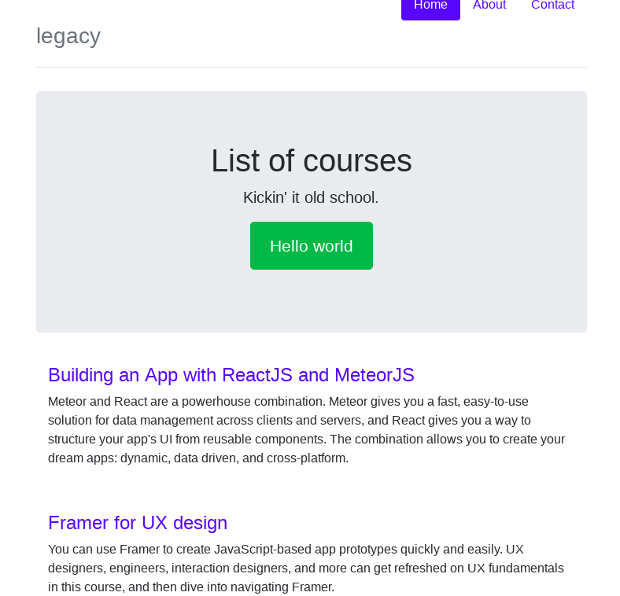

# React Legacy #

Replacing Legacy Projects using ReactJS

- Course on [LinkedIn][1] by [Emmanuel Henri][2]

### Screenshot:




### Adding Development Environment Variables In .env

To define permanent environment variables, create a file called .env in the root of your project:


This works.

```
REACT_APP_SECRET=mySecret
```

and this doesn't

```
SECRET=anotherSecret
```


### References ###

* React Docs - [Adding Development Environment Variables in env][3]

* [ESLint User Guide][4] - The pluggable linting utility for JavaScript and JSX

* [Airbnb Javascript Style Guide][5]

* [Airbnb React/JSX Style Guide][6]


  [1]: https://www.linkedin.com/learning/react-replacing-legacy-projects
  [2]: https://www.linkedin.com/learning/instructors/emmanuel-henri
  [3]: https://github.com/facebook/create-react-app/blob/master/packages/react-scripts/template/README.md#adding-development-environment-variables-in-env
  [4]: https://eslint.org/docs/user-guide/
  [5]: https://github.com/airbnb/javascript
  [6]: https://github.com/airbnb/javascript/tree/master/react


### License

MIT
